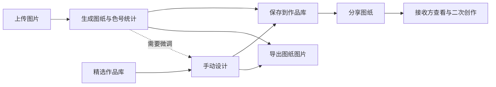

# 豆拼拼豆 · 产品推介 HTML 规划 Spec

版本：v0.8 · 2026-09-23
状态：阶段 C「视觉优化与素材精简」已完成，完整制作链路已补充
阶段记录：2026-09-22 完成规划；2026-09-23 完成视觉、素材对照、最终验收及“色号—用量—备料—制作”价值补强。
适用目录：`showcase-html/`。本文件是后续推介页的唯一规划来源。

## 0. 推荐方案

**用一个猫咪图纸案例，讲清“把喜欢的图片变成能照着买、照着拼的拼豆图纸，再保存、分享和继续创作”的全过程。**

采用响应式单页长滚动 HTML，按 8 个章节组织：**成品吸引 → 三步总览 → 转换设置 → 图纸与用量 → 手动设计 → 作品管理 → 分享与灵感 → 体验入口**。

借鉴参考图的两种表达：

1. 三个真实界面并排，用箭头和动作标题建立整体流程。
2. 一个重点界面配局部放大，用少量文字解释具体价值。

本轮按以下已确认的框架决策执行：

| 决策 | 建议 |
| --- | --- |
| 面向谁讲 | 优先面向拼豆新手和已有拼豆经验的创作者，讲实际用途；技术实现不进入主叙事 |
| 讲什么主线 | 图片变图纸是主线，手动设计是可选分支，作品保存/分享/再创作是后续延伸 |
| 怎么收尾 | 用用户提供的小程序码承接体验，同时保留“查看使用步骤”作为站内动作 |

本轮实际采用**方向 A + 方向 B 实证对照**：以“拼豆图纸说明册”为主视觉方向，用同一猫咪案例的阶段标记串联核心流程；首屏增加猫咪原图和小程序码，独立案例保留“原始生成图片 → 导出图纸”对应关系。因与导出图高度重复，应用内生成画面组已按用户意见删除。未实施方向 D 实物展示。

当前 8 章结构、标题、布局和视觉系统已作为阶段 C 交付落地；后续如有新需求，仍以本文件更新后的口径为准。

## 1. 背景、目标与范围

### 1.1 背景

已有“豆拼拼豆”原生微信小程序及其 Web 适配版本。本次用户提供了 2 张其他产品的推介样式参考，以及 12 张豆拼拼豆的真实使用截图。

本次页面的任务是把能力组织成容易理解的产品介绍。现有 13 个应用页面是能力来源，不要求把 13 个页面逐个展示，也不把后台页面与核心创作流程放在同等位置。

### 1.2 读者与阅读目标

| 读者 | 最关心的问题 | 页面应给出的回答 |
| --- | --- | --- |
| 初次接触拼豆的人 | 我的图片能做成什么？是否难上手？ | 先看到图纸，再看到上传、生成、保存三步 |
| 已有经验的爱好者 | 色板怎么选？用多少豆？能否调整？ | 展示品牌色板、格子色号、用量统计与编辑工具 |
| 想分享作品的人 | 作品能不能留住、分享、接着改？ | 展示作品库、分享落地页和二次创作入口 |

设计目标：读者在首屏识别产品用途，浏览总览后理解主流程，继续阅读后能解释至少三项具体能力。这是页面设计目标，不是已有用户行为数据。

### 1.3 本轮边界

- 规划、内容框架和阶段 C 视觉优化均已完成；最终页面可直接打开，也可通过本地静态服务审阅。
- 最终验收覆盖内容、视觉、交互、响应式、素材与静态服务边界。
- 新页面和派生素材均放在 `showcase-html/`。
- 保留原始 JPG；裁剪、拼接等处理只生成副本。
- 不修改 `pindou/` 应用、`pindou-web-source/` 交付目录和已有 ZIP。
- 本轮不创建云端应用、不重新构建原应用、不提交真实反馈或投稿，也不把本地验收记录表述为正式产品入口。

## 2. 参考形式的提炼

两张参考图均为 960 × 1280 的竖版产品说明，适合提炼为网页章节，而非直接把整张海报贴入页面。

| 参考 | 可借鉴的结构 | 在豆拼拼豆中的应用 |
| --- | --- | --- |
| R01：三步完成 / PRODUCT FLOW | 顶部小分类、结论式大标题、三台手机、步骤箭头、底部行动条 | 第 02 章，用三个真实关键帧串起上传、生成、保存 |
| R02：价格与清单 / HOW IT WORKS | 单个大界面、右侧两项价值、局部强调、底部说明 | 第 04 章，用网格色号与数量统计解释“如何准备材料” |

沿用其“先结论、后界面证据”的方式。参考里的餐饮文案、金额、免费体验承诺、品牌色和搜索入口不迁入本产品。

建议最终以真实截图为主，文字为补充；正文中的每一个重点结论，都应能指向一个具体界面区域。

## 3. 产品表达与能力层级

### 3.1 一句话定位

**豆拼拼豆：不只是把图片变好看，而是变成一份能照着买、照着拼的拼豆图纸。**

备选副标题：

> 用 MARD 或 HAMA 色板对准真实色号，自动算清每色用量与总豆数，再按图备料、制作。

### 3.2 四个记忆点

| 记忆点 | 对用户的价值 | 证据 |
| --- | --- | --- |
| 图片可以转成图纸 | 从已有图片开始创作 | S01、S02 |
| 图纸能对色号、算用量、辅助备料 | 把图片转译为可采购、可动手的制作依据 | S02、S04 |
| 细节可以继续改 | 自动转换之后仍有手动调整空间，也能从空白画布创作 | S02“手动调整”入口、S13、S14 |
| 作品可以留存并继续流转 | 保存后再编辑，或分享给别人接着创作 | S03、S07、S08、S09 |

### 3.3 展示优先级

- **核心展开**：图片转换、色板/参数、图纸色号与用量、导出、手动设计、作品保存。
- **补充展开**：微信分享、分享图纸的二次创作、精选作品库。
- **次级内容**：昵称与标签投稿、管理员审核、用户反馈。
- **暂不使用的宣传口径**：秒级生成、还原度百分比、自动抠图、AI 生图、无限作品存储、永久同步、PDF 导出、交易商城、付费收益。

“图纸生成”不等于“实物制作完成”。没有实物照片时，页面只展示和描述图纸产物。

## 4. 页面信息架构

### 4.1 推荐章节

| 章节 / 锚点 | 回答的问题 | 标题草案 | 主要素材 | 版式职责 |
| --- | --- | --- | --- | --- |
| 01 / `intro` | 这是什么，能做出什么？ | 把喜欢的图片，变成自己的拼豆图纸 | S04 或 S08 图纸裁片 | 大标题与成品图纸建立第一印象 |
| 02 / `workflow` | 图纸在完整制作中解决什么？ | 选好图片只是起点，能照着拼出来才是目的 | S01、S02、S03 | 五步制作链路 + 三个应用关键帧 |
| 03 / `convert` | 效果可以怎样调整？ | 选好色板，调出想要的颗粒感 | S02 参数区 | 设置区放大，逐项解释用途 |
| 04 / `blueprint` | 生成后如何照着拼？ | 每格有色号，每色有用量 | S04、S02 统计区、S06 | 完整图纸加两处局部特写 |
| 05 / `edit` | 我想自己画或修改细节 | 想改哪里，就从那一格开始 | S13、S14 | 爱心画布主体、工具条与红色色板特写 |
| 06 / `workspace` | 做好的图会不会找不到？ | 作品存下来，下次接着改 | S03 | 作品卡片及再次编辑入口 |
| 07 / `share` | 怎么分享和寻找灵感？ | 分享一张图，也分享下一次创作的起点 | S07、S08、S09；S10、S11 次级 | 分享链路与精选库两组证据 |
| 08 / `try` | 我现在怎么用？ | 从你喜欢的一张图片开始 | 已核验入口；可补 Web 预览图 | 一个主要行动及简短版本说明 |

推荐导航压缩为“使用流程 / 生成图纸 / 自由编辑 / 作品与分享 / 开始体验”，避免在手机顶部堆放 8 个导航项。

### 4.2 内容顺序与真实操作顺序

网页先展示成品以建立兴趣，再回到操作流程。实际操作中，手动微调为可选步骤：

完整手工链路为：**选图 → 转成图纸 → 按色号备料 → 逐格拼合 → 熨烫成型**。页面重点突出中间两步，但不把“生成图纸”表述为实体作品已经完成。



图中分享路径以提供的微信使用截图为依据；Web 版本的实现差异见第 7 节。

### 4.3 两种主要分镜

```text
三步总览（桌面）
┌───────────────────────────────────────────┐
│ 使用流程          从上传到留存，先看这三步    │
│ [S01 上传]  →  [S02 已生成]  →  [S03 已保存] │
│ ① 上传图片      ② 生成图纸      ③ 保存作品   │
│           需要修改？继续进入手动设计           │
└───────────────────────────────────────────┘

单项展开（桌面）
┌───────────────────────────────────────────┐
│ 每格有色号，每色有用量                       │
│ [S04 图纸主体]   [同图局部：格子与色号]       │
│                  [S02 局部：色号与数量]      │
│                  一句价值说明 + 导出说明     │
└───────────────────────────────────────────┘
```

手机端按相同顺序纵向排布，三步不缩成三张难以阅读的小图；关键结论不依赖悬浮交互。

## 5. 逐章内容与展示约定

### 01 · 成品吸引

- 结论：产品能把图片转为可查看格子、色号的拼豆图纸。
- 主视觉：优先裁出 S04 的猫咪图纸与图例；如果分辨率不足，则采用 S08 图纸区域。
- 文字：定位标题、一句用途、三个短标签“对色号 / 算用量 / 好备料”。
- 动作：“查看使用步骤”跳到第 02 章；用户提供的小程序码作为微信体验入口。
- 避免：用空画布作首图；把网格图当成未经处理的原图；宣传未经验证的转换速度。

### 02 · 完整制作链路与应用三步

- 先用五个短步骤解释拼豆从选图到熨烫成型的完整链路，重点标出“转成图纸”和“按色号备料”。
- 再用三张真实界面说明应用内的“上传、生成、保存”，不增加大段行业背景。
- ① **上传图片**：S01 裁保留上传按钮和必要的参数上下文。
- ② **生成图纸**：S02 裁保留猫咪图纸以及输出相关按钮。
- ③ **保存作品**：S03 以已经出现猫咪图纸的作品库卡片作为结果证据。
- 各步骤只配一句动作解释，步骤编号属于真实流程。
- 总览下增加一行“需要调整细节时，可继续进入手动设计”，链接第 05 章。
- 三个裁片都标识为关键区域节选，保持同一外框比例，不伪造为三张完整单屏。

### 03 · 参数与色板

- 结论：用户可以选择色板、转换方式、图纸大小和颗粒度。
- 主要素材：S02 参数区；用一个设置界面配三项注释，不重复展示整张超长截图。
- 注释建议：“按手头的品牌选色板”“调整尺寸与颗粒度”“切换算法查看效果”。
- 可准确列出的色板：MARD 221版本、MARD 144版本、HAMA 标准。它们是三套色板选项，不是三个品牌。
- 六种算法有界面和源码依据，但目前素材没有同图六算法完整对比；本轮仅介绍可切换，不评“哪一种最好”。
- 已补充猫咪、蝴蝶、小狗和蝴蝶结的对应原图；由于没有同图不同参数的成组结果，本轮只做静态对应展示，不制作参数对照滑杆。

### 04 · 图纸、用量与导出

- 结论：既能看整体图案，也能查看每格色号和每种颜色的数量。
- 左侧/上方：S04 图纸整体；右侧/下方：同一张图的网格局部和 S02 的统计局部。
- 解释分工：“网格定位”“色号识别”“按颜色统计用量”，不把整张统计长列表贴满页面。
- 导出说明：展示已有“导出高清图”入口。S06 作为保存成功的补充证据，展示时只保留必要状态，不公开设备文件路径。
- 当前能确认的是图纸界面和图片保存过程；截图本身不足以证明原始导出文件的分辨率，不宣传“4K”“无损”。
- 正文引用已核对的猫咪案例：65×87 网格、总数 5,655，且 65×87=5,655。它仅用于说明用量规模，不是产品上限、库存量或所有作品的固定用量。

### 05 · 手动设计

- 结论：支持从空白画布创作，也支持从已有图纸继续编辑。
- S13、S14 是同一套爱心手绘示例；当前没有“猫咪转换结果被局部修改”的连续画面，不能将其声称为猫咪案例下一帧。
- 画布主体与工具条分别裁切展示；可列画笔、橡皮、吸色、填充、撤销/重做、查看/全屏。
- S13 提供工具条和爱心画布，S14 提供 A14 当前色与红系色板；两张图仅按真实界面区域裁切。
- 后续优先补一组同图编辑前后截图，或在隔离浏览器测试数据中采集一次“改色 → 撤销”的真实演示。
- 页面上的说明热点只解释工具，不实现新的画板，不替换原应用。

### 06 · 作品管理

- 结论：已保存作品可以查看、再次编辑，并进入分享流程。
- S03 裁出猫咪卡片完整区域，至少保留缩略图、尺寸/色板信息、再次编辑按钮。
- 可以补充另一张手绘作品，说明图片转换和手绘都能进入作品库。
- 解释“导出图片”和“保存作品”的区别：前者拿到图片，后者用于在应用内管理和继续编辑。
- 不声称无限保存或自动跨设备同步；当前 Web 实现有本地存储与数量限制，必要时放到体验说明中。

### 07 · 分享、灵感与投稿

- 主线 A：S07 微信分享卡片 → S08 分享落地页，突出“接收后可以查看图纸、导出、基于此图二次创作”。
- S07 只取分享消息卡片；聊天对象名称、头像、聊天文字、键盘和浮层不进入公开素材。现有卡片缩略图有空白区域，不能修绘成完整图纸。
- 主线 B：S09 取 3–4 个具有代表性的真实作品卡片，说明可从精选库寻找创作起点；完整列表进入原图查看，不铺成超长正文。
- 次级展开“作品也能投稿”：S10 昵称/标签/选作品 → S11 审核中记录；必须说明需要审核。
- S10 处于提交中，S11 尚未展示该作品发布后的状态。可以说明有投稿与审核流程，不能宣称该次投稿已经入选。
- 本轮不做点赞量、粉丝量、社区活跃度等没有证据的展示，也不把管理员工具放成大众用户功能。

### 08 · 体验入口

- 默认主动作：“开始制作我的图纸”；其目标只能来自已核验的产品入口。
- 微信入口：已配置用户提供的小程序码；发布前仍需用微信复核实际可达性。
- Web 入口：若后续有公开可访问地址，可提供“体验 Web 版”；本机 `127.0.0.1:4173` 仅用于内部预览。
- 站内动作继续使用“查看使用步骤”，不把本机地址作为公开体验入口。
- 本章可用短说明区分微信实际使用截图与 Web 本地演示，用户需要看到的只有与体验有关的区别。
- 用户反馈作为体验后的支持入口，待真实反馈目标明确再接入，不把“本地记录成功”表述成“已发送给团队”。

## 6. 素材台账与加工计划

编号按文件名顺序固定。以下尺寸由本地图片文件读取。全部原图保留不动；本轮联系表只用于选图和讨论。

联系表：[S01–S06](planning/screenshots-01-06.jpg) · [S07–S12](planning/screenshots-07-12.jpg)。S13、S14 为本轮替换素材，直接登记在下表与素材清单中。

| ID | 原始文件（相对本目录） | 像素尺寸 | 内容与状态 | 使用建议 |
| --- | --- | --- | --- | --- |
| S01 | [微信图片_20260922212915_1134_19.jpg](微信图片_20260922212915_1134_19.jpg) | 1080×2939 | 转换页，上传前，图纸区为空 | 第 02 章第一步，仅保留上传和设置区 |
| S02 | [微信图片_20260922212921_1135_19.jpg](微信图片_20260922212921_1135_19.jpg) | 1080×8550 | 转换完成长图，参数、猫咪网格、图例、输出按钮、统计 | 拆成参数、结果、统计/操作三个主要裁片，用于第 02–04 章 |
| S03 | [微信图片_20260922212923_1136_19.jpg](微信图片_20260922212923_1136_19.jpg) | 1080×2340 | 作品库中已有猫咪图纸和手绘作品 | 第 02、06 章，保留一张完整作品卡片 |
| S04 | [微信图片_20260922212926_1137_19.jpg](微信图片_20260922212926_1137_19.jpg) | 1080×2340 | 图纸在图片查看器中展示 | 第 01、04 章，裁去查看器黑边，保留网格、图例与品牌水印 |
| S05 | [微信图片_20260922212928_1138_19.jpg](微信图片_20260922212928_1138_19.jpg) | 1080×2340 | 图片查看器操作菜单 | 补充“保存图片”操作说明，不作主视觉 |
| S06 | [微信图片_20260922212932_1139_19.jpg](微信图片_20260922212932_1139_19.jpg) | 1080×2340 | 图片保存后出现系统提示 | 可作导出补充证据；设备路径不公开 |
| S07 | [微信图片_20260922212933_1140_19.jpg](微信图片_20260922212933_1140_19.jpg) | 1080×2340 | 微信会话中的小程序分享卡片 | 第 07 章，只用卡片区域；缩略图状态保持真实 |
| S08 | [微信图片_20260922212936_1141_19.jpg](微信图片_20260922212936_1141_19.jpg) | 1080×2620 | 分享落地页，图纸、统计、二次创作和导出入口 | 第 07 章主证据；可作为首图备选 |
| S09 | [微信图片_20260922212940_1142_19.jpg](微信图片_20260922212940_1142_19.jpg) | 1080×5570 | 精选作品库长列表 | 第 07 章，裁顶部分类和少量作品卡，不整图缩入手机 |
| S10 | [微信图片_20260922212941_1143_19.jpg](微信图片_20260922212941_1143_19.jpg) | 1080×2340 | 投稿表单，已选作品和标签，提交中 | 投稿次级展开；不能作为提交成功状态 |
| S11 | [微信图片_20260922212943_1144_19.jpg](微信图片_20260922212943_1144_19.jpg) | 1080×2340 | 管理员审核页，审核中作品，精选区暂无审核通过作品 | 投稿次级展开；标明管理员端，不声称已发布 |
| S12 | [微信图片_20260922212945_1145_19.jpg](微信图片_20260922212945_1145_19.jpg) | 1080×4542 | 原手动画布、颜色、工具及输出入口，包含随手涂画片段 | 仅留档，不再用于正文 |
| S13 | [manual-heart-editor.jpg](manual-heart-editor.jpg) | 1080×3424 | 新的爱心手绘界面，包含工具条与完整画布 | 第 05 章，裁工具条与爱心画布 |
| S14 | [manual-heart-palette.png](manual-heart-palette.png) | 800×1542 | 爱心手绘界面的 A14 当前色与红系色板 | 第 05 章，裁颜色选择区 |

### 6.1 加工规则

1. 所有正式裁片必须记录来源 ID、裁剪坐标、所属章节、说明文字；坐标在框架阶段确定。
2. 长图按语义区域切割。不得拉伸为手机比例，不得缩成无法阅读的细长条。
3. 设备框只是承载容器。已有系统栏与外框避免重复；素材来自 Android 微信，不添加虚假的 iOS 状态栏。
4. 裁片保持原始比例；设备里需要截取时，完整图通过“查看完整截图”访问。
5. 图纸保留色号、数字、网格和“豆拼拼豆”水印；不修饰结果以制造更高还原度。
6. 系统状态栏、右侧辅助浮层优先通过裁剪避开；覆盖核心区域时优先补拍，不用生成式修图补造界面。
7. 拼接不同区域时，保留分隔和说明，标记为“界面关键区域节选”；不得伪装成连续的一次操作录像。
8. 先处理无需公开的聊天信息、账号标识、设备路径，再生成可放大的公开版。灯箱中的完整图也必须使用处理后的副本。
9. 只使用用户已提供或后续实际采集的产品画面；生成图片不能替代功能证据。

### 6.2 素材缺口

| 待补内容 | 用途 | 缺失时的可行方案 |
| --- | --- | --- |
| 同图不同颗粒度/算法结果 | 证明参数变化带来的差异 | 用参数区说明可调选项，不伪造实时效果 |
| 同一作品编辑前后 | 更直观地证明微调 | 用 S13/S14 的爱心手绘画布说明工具，标为独立示例 |
| 投稿完成与入选结果 | 完整展示投稿闭环 | 展示至“审核中”，入选只写条件流程 |
| 猫咪主线的干净导出图 | 高清网格局部与图例展示 | 使用 S04/S08 裁片，放大不超出可读分辨率 |
| 公开 Web 地址 | Web 体验入口 | 本轮保留小程序码与站内步骤；公开地址上线后再增加 |
| 最新 Web 桌面/手机截图 | 展示 Web 体验方式 | 本轮以微信实拍为主；若强调 Web，再从现有预览采集 |

猫咪原图缺口已由 O07 补齐；O01/O03/O04 分别补齐蝴蝶、小狗和蝴蝶结原图。其余缺口仍按降级规则处理：不补占位、不生成替代证据，也不扩展相应宣传口径。

### 6.3 `new_photo` 审计与接入结果

- `../new_photo/` 中 N01–N12 已逐项登记文件名、尺寸、SHA-256、来源与授权状态；N12 与 N08 哈希相同，清单已记录重复关系。
- `../new_photo/original_photo/` 中 O01–O07 同样完成文件名、尺寸、SHA-256、来源与授权状态登记。
- N01–N12 均为用户于 2026-09-23 提供并授权用于本次豆拼拼豆推介页的素材；**对外使用前仍需确认第三方角色权利**，本轮授权不等于第三方角色权利已经完备。
- N04/N06/N09 分别作为蝴蝶、小狗、蝴蝶结完整导出图；N05/N07/N10 因与导出图重复，仅保留审计记录，不生成公开副本。
- O01/O03/O04 分别作为三组独立案例原图，O07 作为猫咪主线原图；其他 N/O 素材只保留审计记录，不生成公开副本、不展示空占位。最终公开来源副本为 18 个：S 系列 11 个、N 系列 3 个、O 系列 4 个。

## 7. 事实口径与版本边界

证据优先级：**提供的真实使用截图 → 当前对应端源码 → 已有验收记录 → 早期 PRD**。早期 PRD 的规划功能不能当成已实现功能宣传。

| 内容 | 当前依据 | 推介页允许的表述 / 限制 |
| --- | --- | --- |
| 图片转图纸 | S01、S02；`src/pages/pixel/` | 上传图片生成像素图纸；不声称文生图 |
| 色板与算法 | S02；`src/data/palettes.ts`、`src/utils/colorMetrics.ts` | MARD/HAMA 三套色板、六种算法可选；不承诺效果排名 |
| 色数上限 | 原生转换行为及迁移记录 | 不宣传严格限色；S08 标题中的“24 色”不能直接当作实际统计色数 |
| 格子色号与统计 | S02、S04、S08 | 支持查看色号和用量；正文不把格子尺寸单位当成实体厘米 |
| 图片导出 | S04–S06；`src/utils/ui.ts` | 微信支持保存图片；Web 有 PNG 下载实现，两者操作描述分开 |
| 手动设计 | S13、S14；`src/pages/designer/` | 画笔、橡皮、吸色、填充、撤销重做等；截图不证明所有动作已逐项实测 |
| 作品保存 | S03；`src/services/artworkStorage.ts` | 可保存并再编辑；当前 Web 最近作品上限为 5，不宣传无限或永久保存 |
| 微信好友分享与二次创作入口 | S07、S08 | 可展示提供的实际微信链路；不得据此宣称 Web 已实现微信原生分享 |
| Web 分享/同步 | `src/utils/ui.ts`、`src/services/cloud.ts` | Web 复制链接、使用本地模拟数据；不能保证任意大作品跨设备完整恢复，也不能宣称生产云同步已上线 |
| 投稿审核 | S10、S11 | 展示有投稿、标签和审核机制；管理员才能审核，不把按钮出现当成审核成功 |
| 商业化和运营 | 无有效证据 | 不展示免费额度承诺、付费方案、用户量、效率提升或收益数据 |

说明：

- 当前批次是微信小程序实际使用截图；若补拍 Web，须分别标注“微信小程序实拍”与“Web 版演示”，避免混为同一运行环境。
- 旧验收文档包含不同阶段的测试统计和环境记录，本推介页不以测试项数量作对外卖点。
- `127.0.0.1` 是本机地址，不能用于向公众承诺在线体验。线上分享版本的 CTA 单独配置真实入口。

## 8. 推介页交互 Spec（最终实现）

| 场景 | WHEN | THEN |
| --- | --- | --- |
| 阅读流程 | 点击导航或“查看使用步骤” | 跳至对应章节，标题完整可见，URL 锚点可直接访问 |
| 查看细节 | 点击带“查看大图”的截图 | 打开图片查看层，显示公开版图片、说明与来源端；支持关闭、Esc、返回触发按钮焦点 |
| 手机浏览 | 视口为 375/390/430px | 三步和图文对照依阅读顺序纵排，无横向溢出，正文无需缩放阅读 |
| 色号特写 | 查看第 04 章 | 同时能辨认整体图案与局部色号/用量；不要求从一张缩小的全图读小字 |
| 投稿细节 | 点击“作品如何进入精选” | 展开 S10/S11 和“需审核”说明；默认不占据主流程大篇幅 |
| 点击截图里的按钮 | 点击截图中画出来的控件 | 仅作为截图内容；可打开大图，不模拟上传、保存或提交成功 |
| 进入产品 | 点击已配置的体验入口 | 打开经过验证的目标，能分辨微信使用方式和 Web 体验方式 |
| 入口尚未配置 | 没有正式产品链接/码 | 使用“查看使用步骤”；不出现假二维码、空链接或点击无响应的主按钮 |
| 禁用脚本/减少动效 | JS 不可用或设置减少动效 | 正文与核心截图仍可阅读；不依赖自动轮播或动效完成理解 |

本轮只实现阅读辅助交互。参数变化演示、前后对照滑杆等依赖成套素材，未启用并已按降级规则核对。

## 9. 视觉方向与阶段 C 落地

最终采用“拼豆图纸说明册”：参考图的编辑式排版、结论标题、真实设备截图，结合豆拼拼豆的橙色强调和色号元素。

- 主题材料：网格纸、拼豆色卡、图纸图例、真实手机关键帧。
- 主视觉记忆点：**同一图纸在不同阶段的出现，以及从完整图纸引出的局部色号特写**。
- 结构规则：大图与短文案交替；总览横排，细节章图文对照，作品章用少量真实卡片。
- 配色角色：浅纸色背景、墨色正文、品牌橙主强调、辅助冷灰；色板截图承担丰富色彩。
- 字体角色：标题强调识别度，正文强调可读性，色号/尺寸使用清晰数字样式；字号、行长和间距已在响应式规则中固定。
- 采用中性手机框，避免抢过真实截图。桌面截图使用浏览器框，不套手机框。
- 不照抄参考的红色餐饮品牌，也不添加无依据的价格卡、评价墙或运营数据。
- 参考图的 3:4 比例可作为后续章节截屏传播的构图参考；网页本身保持自然滚动，不强制每章固定一屏高。
- 样式按职责拆分为 `styles.css`、`styles-sections.css`、`styles-outcomes.css`、`styles-responsive.css`，四份 CSS 在 HTTP 与 `file://` 终验中均成功加载。

## 10. HTML 实现约定

### 10.1 页面与原应用关系

推介页独立运行，以静态 HTML/CSS 和少量 JS 为默认方案。产品截图以文件呈现，不要求打开原应用才能看正文，也不把整个应用作为首屏 iframe 嵌入。

原应用保持现状，推介页通过可配置入口跳转至它。后续如需发布，按选定平台的托管约束处理入口和素材，不在本阶段绑定域名、端口或云平台。

### 10.2 当前文件结构

```text
showcase-html/
├── spec.md                       # 当前唯一规划来源
├── README.md                     # 独立打开及预览说明
├── index.html                    # 8 章节正文及语义结构
├── styles.css                    # 全局 token、基础排版与交互状态
├── styles-sections.css           # 章节构图与视觉组件
├── styles-responsive.css         # 响应式与减少动效规则
├── interactions.js               # 大图查看与键盘交互
├── assets/                       # 31 张展示图、18 张公开来源副本，共 49 个 WebP
├── assets-manifest.json          # S01–S14、N01–N12、O01–O07 来源审计及派生关系
├── 微信图片_*.jpg                 # 已提供原图，保持原样
├── planning/
│   ├── screenshots-01-06.jpg      # 选图联系表
│   └── screenshots-07-12.jpg
├── scripts/
│   ├── prepare-assets.py         # 从原 JPG 生成裁片与清单
│   └── serve.cjs                 # 无构建的本机预览服务
└── verification/                 # 浏览器与素材检查结果、审阅截图
```

如目标托管平台要求使用远端素材 URL，在清单里记录其对应关系；原始素材与裁剪信息仍留存，便于迁移。

### 10.3 内容与素材字段

- 章节：`id`、标题、一句话价值、正文、素材 ID、说明、可选动作。
- 素材：`id`、源文件、源尺寸、裁剪区域 `[x,y,width,height]`、派生文件、所属端、alt 文本、公开前处理记录。
- 体验入口：微信说明/真实小程序码、公开 Web 地址、本地审阅地址分别配置，缺失时不渲染相应体验按钮。
- 标题和说明使用可编辑 HTML 文本，不烘焙进整页大图。

## 11. 分阶段任务与验收

| 阶段 | 工作 | 交付结果 |
| --- | --- | --- |
| A · 规划（已完成） | 分析截图、确定主线和章节、建立素材映射 | 本 spec 和联系表；2026-09-23 用户已确认 |
| B · 内容框架（已完成） | 按 8 章节写入真实文案、裁片、导航、大图查看与展开 | 可直接打开的静态 HTML |
| C · 前端美化（已完成） | 字体、配色、空间节奏、设备框、局部标注、轻动效 | 方向 A + 方向 B 轻量的桌面与手机精修版 |
| D · 最终验收与交付（已完成） | 核对公开素材、能力口径、链接、响应式、浏览器行为 | 本地完整目录及 `status=passed` 的终验证据 |

### 11.1 本轮 spec 检查

- [x] 分析两张参考图，并明确可借鉴的表达结构。
- [x] 为全部 12 张截图分配稳定 ID、记录尺寸和用途。
- [x] 提供章节顺序、标题草案、主图选择与步骤分镜。
- [x] 标清原图缺失、重复片段、提交中、待审核等证据边界。
- [x] 区分微信实际使用与 Web 本地模拟能力。
- [x] 原应用和交付 ZIP 不在本轮修改范围。
- [x] 用户确认框架（2026-09-23：“确认执行”）。

### 11.2 内容框架完成标准

- 8 个章节均有真实内容；读者能顺着“生成—查看—编辑—留存—分享”理解产品。
- 每项主要能力有对应截图区域，且同一案例/独立示例标识清楚。
- 超长截图已按语义分段，主要截图可放大，完整公开版可访问。
- 投稿显示至“审核中”的事实状态；不出现未经证实的完成态。
- 无占位图片、伪造原图、虚假二维码、没有目标的按钮。
- 全部正文可编辑，不依赖先启动原应用或连接云数据。

### 11.3 美化与交互验收结果

- 1440×1000、375×812、390×844、430×932 四个视口均无页面横向滚动；手机导航保持单行，下一章提示与主图在首屏可见。
- 8 个章节锚点均以新页面逐项验证，标题可见且不被导航遮挡。
- 31 张正文图均返回 WebP、自然宽度有效；31 个灯箱入口均可打开、Esc 关闭并返回焦点。
- 灯箱关闭按钮、遮罩、焦点循环、原始尺寸模式和公开来源链接均通过。
- 无 JavaScript、`prefers-reduced-motion: reduce`、`file://` 直接打开、本地 HTTP 服务均通过。
- 四份 CSS、49 个 WebP、favicon 与正文资源请求均通过；页面控制台无 JavaScript 错误。
- 使用独立审阅环境验证，未向真实联系人发送消息，也未产生真实投稿或审核操作。

## 12. 最终决策与保留边界

| 项目 | 本轮结果 | 保留边界 |
| --- | --- | --- |
| 优化路线 | 方向 A + 方向 B 实证对照，并补充小程序码入口 | 未启用方向 D 实物展示 |
| 主要受众 | 拼豆新手与爱好者 | 主叙事讲用户价值，不把技术栈或测试数量作为卖点 |
| 章节数量与权重 | 8 章，核心创作展开，投稿审核次级 | 猫咪案例为主线，N04/N06/N09 及其对应原图仅作独立案例 |
| 主要产品入口 | 用户提供的小程序码 + “查看使用步骤” | 小程序码在发布前仍需扫码复核；不把本机地址作为公开 CTA |
| 素材增强 | 审计 N01–N12、O01–O07；接入猫咪原图及三组原图/导出图纸 | 应用内生成画面组因重复删除；不声称提供参数对照、编辑前后、实物作品或投稿入选结果 |
| 展示气质 | 拼豆图纸说明册 + 品牌橙 + 色号标记 | 不使用虚构数据、AI 替代证据或无信息装饰 |

缺失素材继续按第 6.2 节降级，不以新造画面补齐证据。小程序码已接入，发布前仍需单独复核可达性。

## 13. 阶段 C 执行与最终验收记录 · 2026-09-23

### 13.1 最终产物

- [推介页](index.html)：8 个语义章节、5 项导航、31 张正文图和 31 个灯箱入口。
- [启动说明](README.md)：支持直接打开 HTML，或运行 `node scripts/serve.cjs` 后访问 `http://127.0.0.1:4174/`。
- [素材清单](assets-manifest.json)：S01–S14、N01–N12 与 O01–O07 的来源审计、派生关系和授权限制；31 张展示图、18 张公开来源副本，共 49 个 WebP。
- 样式分为 [全局样式](styles.css)、[章节样式](styles-sections.css)、[案例样式](styles-outcomes.css)、[响应式样式](styles-responsive.css)。

### 13.2 最终证据

| 验收项 | 结果与范围 |
| --- | --- |
| 总状态 | [浏览器终验](verification/final-results.json) 为 `status=passed`、`failures=[]` |
| 章节与图片 | 8 章；31 张正文图请求成功；31 个灯箱逐项打开、关闭与焦点返回通过 |
| 响应式 | 1440×1000、375×812、390×844、430×932 四个视口通过，无页面横向溢出 |
| v0.8 增量检查 | 新增五步制作链路及 5,655 颗案例后，1440、1180、430、375px 均无页面横向溢出或图片加载失败 |
| 降级与独立运行 | 无 JavaScript、减少动效、`file://` 和本地 HTTP 服务均通过 |
| 素材与样式 | [素材终验](verification/final-asset-checks.json) 为 `passed`；4 份 CSS、49 个 WebP、正文图片请求均通过 |
| 静态服务边界 | 原始素材路径及编码/反斜杠/NUL 等路径穿越用例全部被 400/404 阻断 |
| 新素材 | S13/S14 完成尺寸、哈希与裁片审计并用于爱心手绘案例；N01–N12 与 O01–O07 保持既有审计范围 |
| 事实边界 | 已提供四张对应原图和小程序码；仍未提供参数对照、编辑前后、实物或公开 Web 地址，页面按降级规则呈现 |

终验截图：[1440×1000](verification/final-phase-c-clean-1440x1000.png) · [375×812](verification/final-phase-c-clean-375x812.png) · [390×844](verification/final-phase-c-clean-390x844.png) · [430×932](verification/final-phase-c-clean-430x932.png) · [无脚本](verification/final-phase-c-clean-no-js.png) · [减少动效](verification/final-phase-c-clean-reduced-motion.png) · [`file://`](verification/final-phase-c-restart-file-1440x1000-full.png)。

检查范围仅为独立推介页；未重新测试或构建原应用，未测试实体手机或 Safari。本记录不声明任何云端部署状态。

## 附：事实来源

- [参考图 R01 · 三步产品流程](planning/reference-01-product-flow.png)：本轮上传的 `67550b8c-f647-4cd3-a2ae-7d85640e66ae_image.png` 的原样副本。
- [参考图 R02 · 单项能力说明](planning/reference-02-feature-detail.png)：本轮上传的 `36cae214-1a10-4bf3-9353-56afbed4e908_image.png` 的原样副本。
- 本目录 S01–S14：用户提供的实际使用截图；S13、S14 为替换后的爱心手绘案例。
- `../new_photo/` N01–N12：补充图纸及备选生成界面；`../new_photo/original_photo/` O01–O07：补充原始生成图片。
- [现有 Web 说明](../pindou/README.md)
- [迁移与既有验收记录](../pindou/docs/replica-implementation.md)（包含历史阶段信息，非本轮重新测试结论）
- [应用页面清单](../pindou/src/app.config.ts)
- [品牌定义](../pindou/src/config/brand.ts)
- [色板数据](../pindou/src/data/palettes.ts) · [算法选项](../pindou/src/utils/colorMetrics.ts)
- [像素转换页面](../pindou/src/pages/pixel/index.tsx) · [手动设计页面](../pindou/src/pages/designer/index.tsx)
- [作品保存模型](../pindou/src/services/artworkStorage.ts)
- [Web 下载与链接分享](../pindou/src/utils/ui.ts) · [微信/Mock 分流](../pindou/src/services/cloud.ts)
